# Star Seeker

Name: Noura Belkhatir

Student Number: C22388271

Class Group: A Team 19

# itch.io link

after exams 👍

# Video

[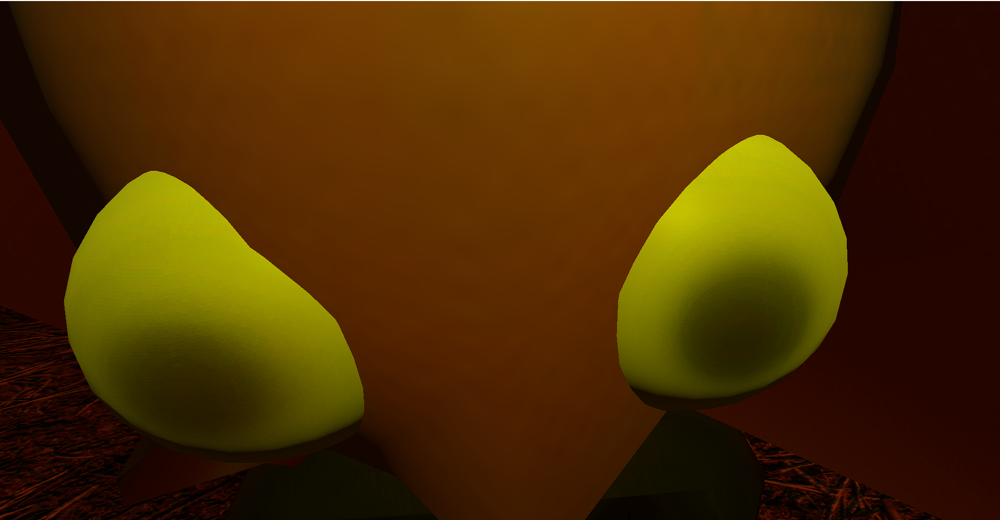](https://youtu.be/cn7bbWR2a0I)

This is youtube video

# Screenshots

## Menus

### Main menu
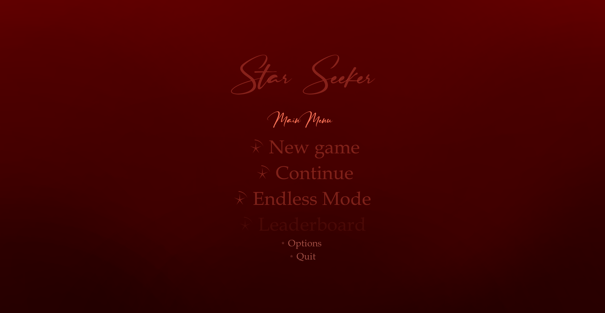

### Options menu
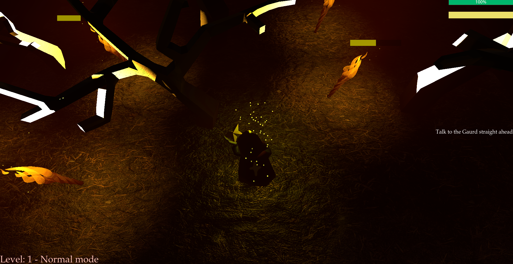

### Normal death
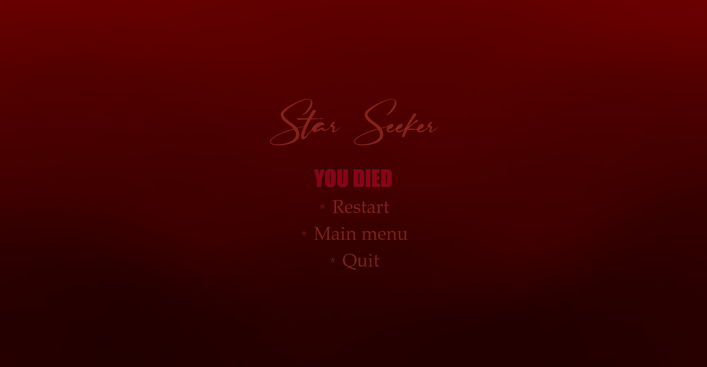

### Endless death
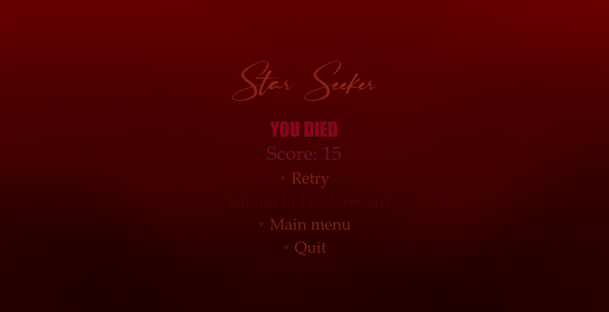

### Win
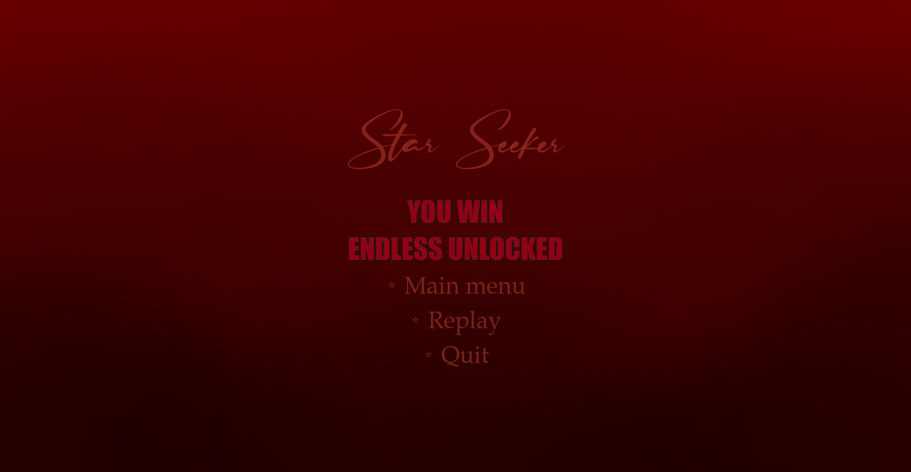

### Paused screen
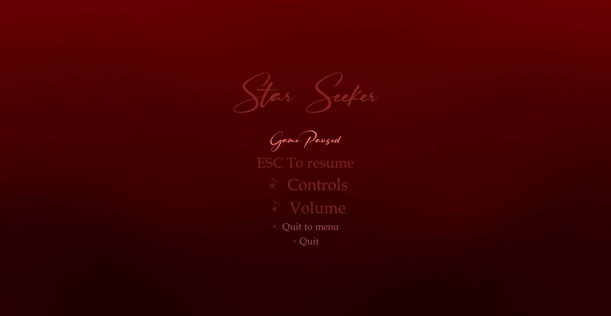

### Cutscenes

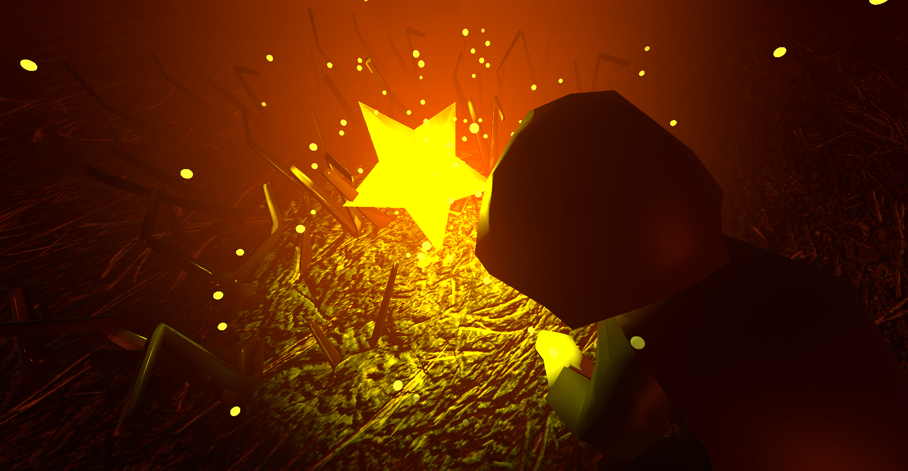

## Gameplay

### Level 1

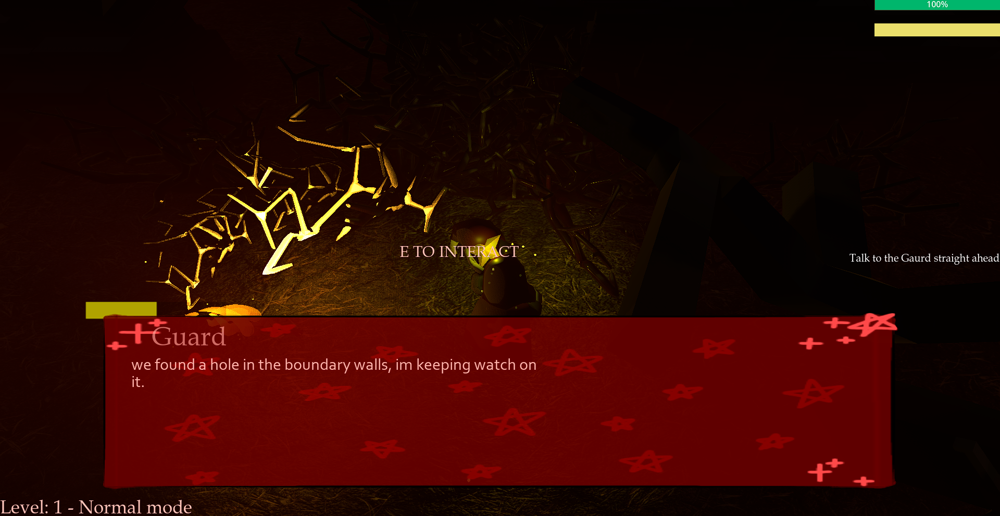

### Level 2
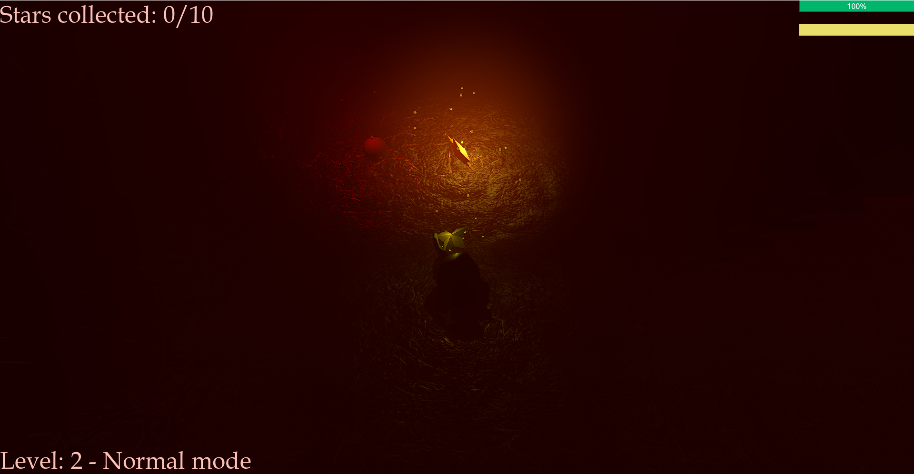

### Enemy particles
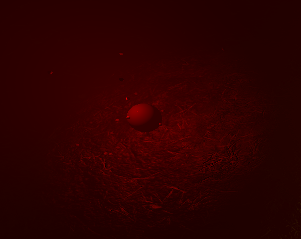
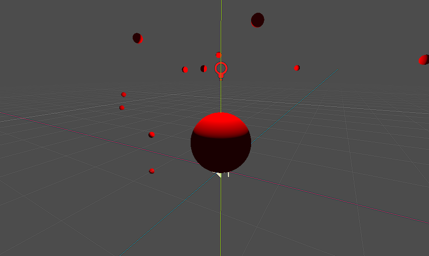

### Star particles
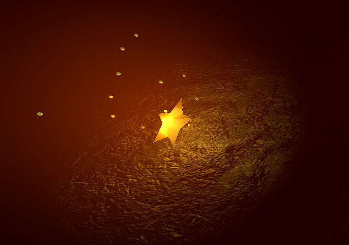
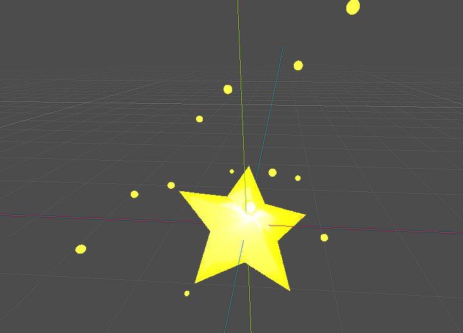

## Tutorials

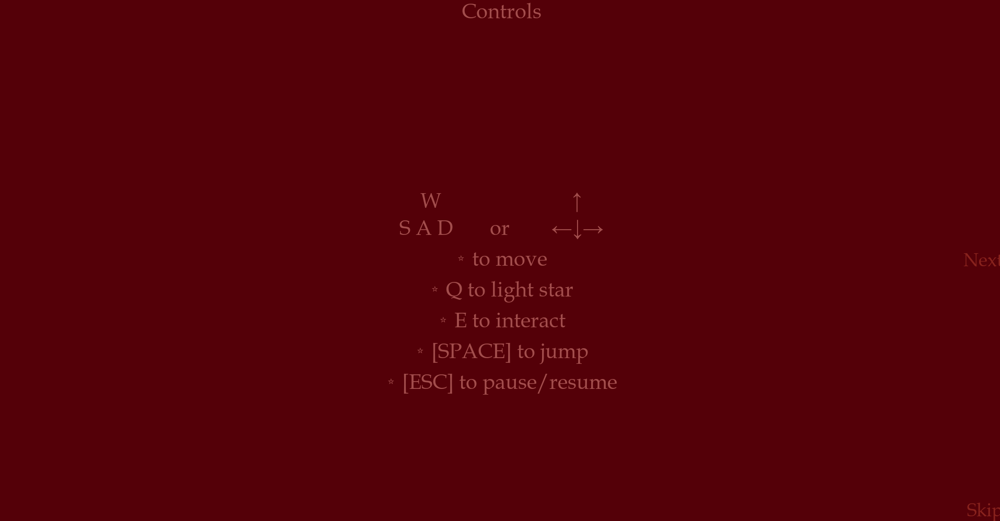
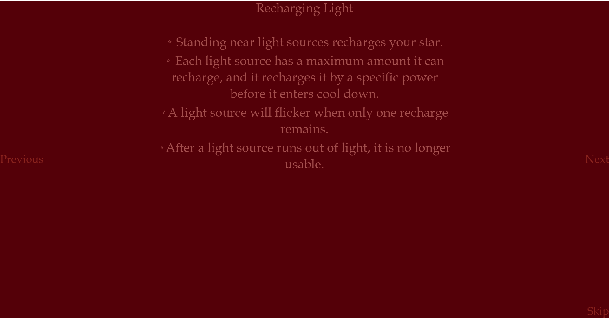
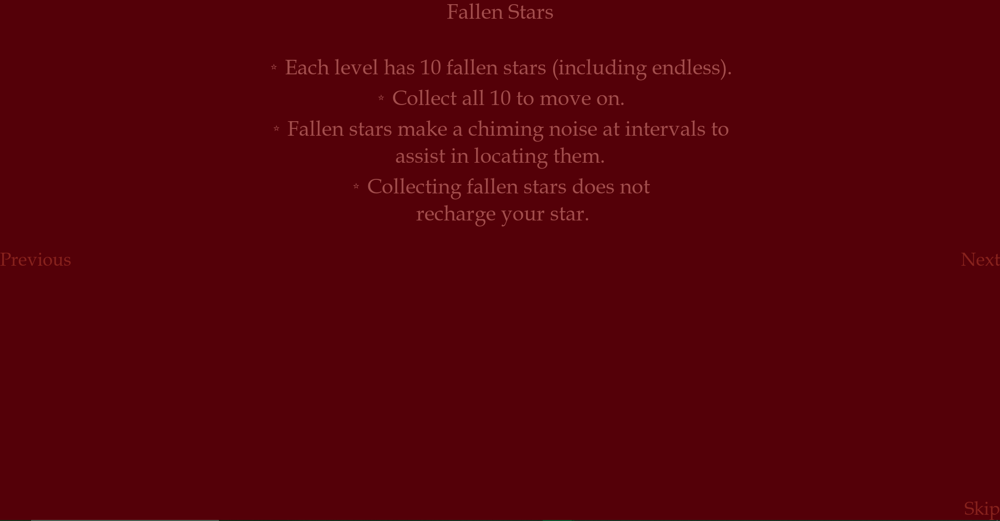
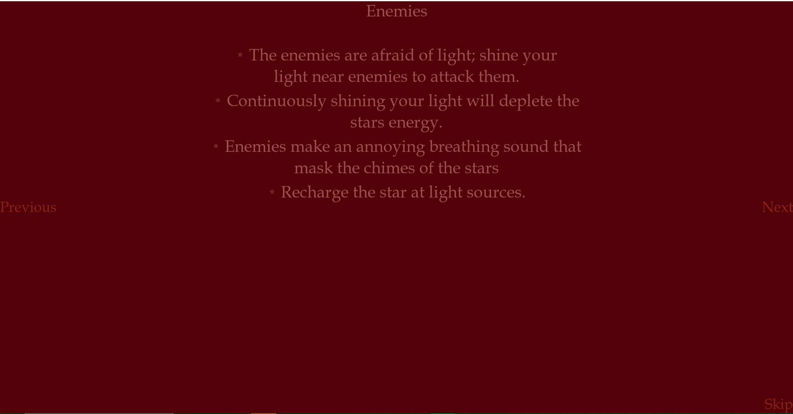
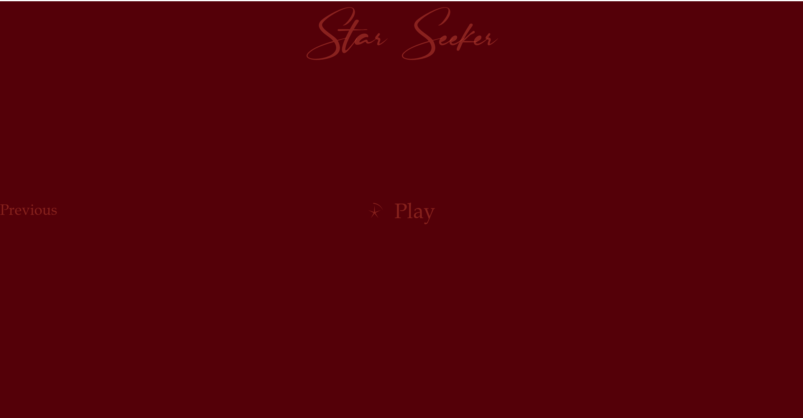

# Description for Project

Top-down esque game. Collect ten fallen stars to unlock endless mode.

Endless mode uses procedural maps to constantly recreate the map and respawn the player
every time they collect ten fallen stars.

Amount of enemies increases with the level ups.

# Instructions

# List of Assets/Resources
### Music:

Gameplay: https://www.youtube.com/watch?v=1vd_CE_Kvug&ab_channel=WhiteBatAudio

Menus: https://www.youtube.com/watch?v=JiynONsMN1g

Cutscene: https://www.youtube.com/watch?v=kTKpRL5_k_0

### Audio:
Star chimes: https://pixabay.com/sound-effects/chimes-30058/

Wind: https://pixabay.com/sound-effects/wind-1-44149/

Enemy sounds: https://pixabay.com/sound-effects/wind-shear-192375/

### Assets:
Player - me

Stars - me

Trees - me

Bushes - me

Walls - me

Lamps - https://sketchfab.com/3d-models/torch-d659eb741e4c48e09527f9fbb4104186

### Textures:

Floor - https://cc0-textures.com/

### Fonts:

Titles: https://www.dafont.com/ruthligos.font

 
