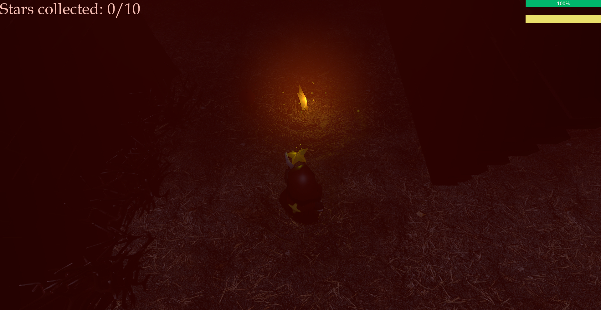

# Star Seeker

Name: Noura Belkhatir

Student Number: C22388271

Class Group: A Team 19

# itch.io link

(wip)

# Video

# Screenshots

# Description for Project

Top-down esque game. Collect ten fallen stars to unlock endless mode.

Endless mode uses procedural maps to constantly recreate the map and respawn the player
every time they collect ten fallen stars.

Amount of enemies increases with the level ups.

# Instructions

# List of Assets/Resources
### Music:

https://www.youtube.com/watch?v=1vd_CE_Kvug&ab_channel=WhiteBatAudio

### Audio:
Star chimes: https://pixabay.com/sound-effects/chimes-30058/

Wind: https://pixabay.com/sound-effects/wind-1-44149/

Enemy sounds: https://pixabay.com/sound-effects/wind-shear-192375/

### Assets:
Player - me

Stars - me

Trees - me

Bushes - me

Walls - me

Lamps - https://sketchfab.com/3d-models/torch-d659eb741e4c48e09527f9fbb4104186

### Fonts:

Titles: https://www.dafont.com/ruthligos.font

 
